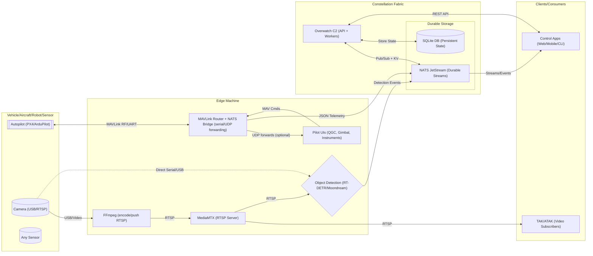

# Constellation Overwatch Organization

🛰️ Open-source C4ISR data fabric for edge command, control, and communications 🌐

## 🎯 Mission
Inspired by Anduril Lattice and ROS, we build tools for autonomous fleet management. Enable pub/sub messaging, real-time telemetry streams, video-based object detection, and tactical awareness for hybrid fleets of drones, aircraft, and robots.

## Network Data Flow Diagram

## 🤖 Supported Platforms
- ✈️ Aircraft: Fixed-wing, eVTOL, airships
- 🚁 Drones: Class 1-3 multirotors, hexacopters, swing-wing
- 🦾 Robots: Humanoids, quadrupeds, amphibious systems

Supports MAVLink protocols (PX4/ArduPilot), video streams (USB/RTSP/HTTP), and edge sensors via NATS JetStream for durable, hierarchical pub/sub.

## 🚀 Core Projects
### 1. Constellation Overwatch (C2 Server)
Central mesh fabric for fleet management:
- REST API for org/entity registration, status updates, and queries (Bearer auth).
- Embedded NATS JetStream for pub/sub events, telemetry, and commands.
- SQLite DB for persistent state; durable workers process streams.
- Hierarchical subjects: `constellation.{org_id}.{entity_id}` for telemetry/commands.

**Usage**:
- Clone: `git clone https://github.com/Constellation-Overwatch/constellation-overwatch.git`
- Run: `go run ./cmd/microlith/main.go` (starts API on :8080, NATS on :4222).
- Create org: `curl -X POST http://localhost:8080/api/v1/organizations -H "Authorization: Bearer <token>" -d '{"name":"Fleet"}'`
- Register entity: `curl -X POST http://localhost:8080/api/v1/entities?org_id=<org_id> -H "Authorization: Bearer <token>" -d '{"name":"Drone-001","entity_type":"aircraft_multirotor"}'`
- Clients subscribe to NATS subjects for real-time updates.

### 2. MAVLink Router + NATS Bridge
High-performance Go bridge routes MAVLink messages (serial/UDP) to NATS JetStream:
- Auto-fingerprints devices from HEARTBEATs; publishes parsed telemetry (GPS, attitude, battery) as JSON.
- Supports serial (e.g., RFD900 on /dev/ttyUSB0), UDP discovery, or static ports.
- Hierarchical publishing: `constellation.{org_id}.{entity_id}`; updates KV store for current state.

**Usage**:
- Clone: `git clone https://github.com/Constellation-Overwatch/mavlink2constellation.git`
- Configure .env: Set `NATS_URL=nats://localhost:4222`, serial/UDP inputs, org/entity IDs.
- Run: `go run main.go`
- Integrates with existing systems: Replaces/extends mavlink-routerd; forwards to QGC/gimbal UIs while bridging to NATS.

### 3. Object Detection Client
Python edge inference on video streams; publishes detections as NATS events:
- Models: RT-DETR (fast, 80 COCO classes, 30-60 FPS) or Moondream (natural language queries, slower).
- Inputs: Webcam, RTSP/HTTP streams, device paths.
- Outputs: JSON events to `constellation.events.isr` with timestamps, bounding boxes, confidence.

**Usage**:
- Clone: `git clone https://github.com/Constellation-Overwatch/overwatch-obj-detection.git`
- Install: `uv sync`; configure .env with org/entity IDs, NATS URL.
- Run RT-DETR: `uv run -m detect_rtdetr --rtsp <url>` (e.g., from MediaMTX/FFmpeg).
- Events include device fingerprint; view annotated feed, press 'q' to exit.

## 🛠️ Built For
Self-hosted edge deployments: Run on edge machines for tactical awareness. Integrates MAVLink telemetry, video streams, and detections into a unified NATS fabric for real-time C2 and analytics.

Empowering autonomous edge fleets 🌟